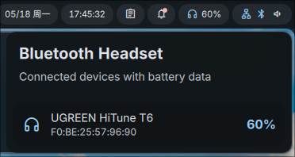

# Bluetooth Headset Battery

蓝牙耳机电量插件，用于在 DankBar 中展示当前已连接蓝牙耳机的电量。

## 功能

- 状态栏显示已连接蓝牙耳机的电量
- 弹窗查看当前连接设备的电量列表
- 依赖系统已有的蓝牙设备信息，不额外轮询外部接口

## 使用

1. 确保系统已经连接蓝牙耳机
2. 启用插件
3. 在状态栏直接查看耳机电量

## 说明

- 只有支持上报电量的设备会显示电量
- 如果设备没有电量信息，插件会隐藏该设备
